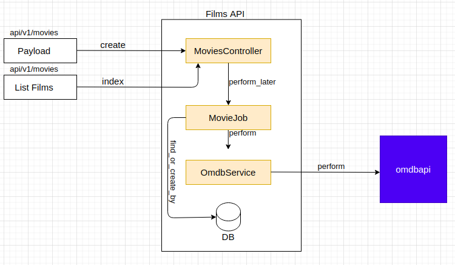

# Films API :film_strip:

Uma API de Filmes

## Para roda o projeto
Para colocar o aplicativo em execução, execute os seguintes comandos:

- Build container
```
docker-compose build
```

- Instalando as gems
```
docker-compose run --rm webservice bundle install
```

- Criando o banco de dados
```
docker-compose run --rm webservice bundle exec rails db:create
```

- Gerando migrate
```
docker-compose run --rm webservice bundle exec rails db:migrate
```

> confiruando master key.

- Acesse o container webservice
```
docker-compose run --rm webservice bash
```

 - Para gerar a **secret_key_base** execute o seguinte comando
```
docker-compose run --rm webservice bundle exec rails secret
```

 - Cole este trecho de codigo quando abrir o editor no proximo passo.
```
test:
 secret_key_base: 
 omdb_api_key: 
 omdb_api_url: http://www.omdbapi.com/

development:
 secret_key_base: 
 omdb_api_key: 
 omdb_api_url: http://www.omdbapi.com/

production:
 secret_key_base: 
 omdb_api_key: 2e9eefb7
 omdb_api_url: http://www.omdbapi.com/
```

- Abrindo o editor
```
EDITOR=nano bundle exec rails credentials:edit
```

- Execute os testes
```  
docker-compose run --rm webservice bundle exec rspec
```

- Up service
```  
docker-compose up
```

## Payload

```
{
  "movie": [
    {
      "title": "Captain Marvel"
    },
    {
      "title": "Frozen"
    },
    {
      "title": "Click"
    },
    {
      "title": "Airplane!"
    },
    {
      "title": "Doctor Strange"
    },
    {
      "title": "A Clockwork Orange"
    },
    {
      "title": "Rosemary's Baby"
    },
    {
      "title": "Once Upon a Time in Hollywood"
    },
    {
      "title": "taxi driver"
    },
    {
      "title": "the hateful eight"
    }
  ]
}
```

## Solução

Existe dois endpoint um para listar os filmes processados e o outro para enviar uma lista de títulos de filmes para processo, pode se observar na imagem abaixo.

Quando Uma lista de títulos de filmes é enviada, a mesma chega no MoviesController
O controlador é o responsável por chamar o MovieJob, então é executado o perform_later, que irá executar assim que possível.

A lista de títulos de filmes vai ser enfileirada no redis, assim que esta lista for executada o service OmdbService. O Service OmdbService é responsável por realizar as chamadas para a API OMDbAPI. Então é passado um título de  filme de cada vez para o service buscar.

Assim que essa busca por feita o resultado é retornado para o MovieJob, pois é nele que é chamado o model Movie que vai persistir esta busca no banco de dados.

Todo esse processo pode ser visto na imagem abaixo seguindo o fluxo como foi descrito acima.




## Stack

 - Ruby on Rails
 - Postgres
 - Redis
 - Docker
 - Docker compose

## Authors

- [brandaoplaster](https://github.com/brandaoplaster)

## License

This project is licensed under the MIT License - see the [LICENSE.md](LICENSE.md) file for details